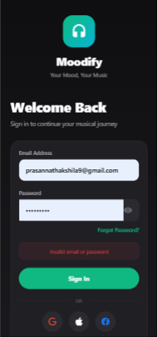
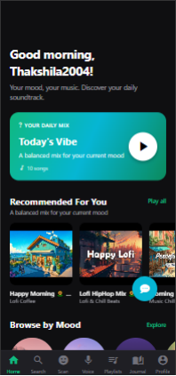
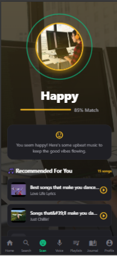
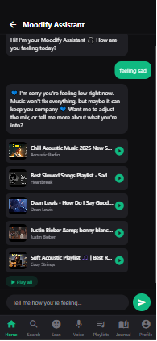

<div align="center">

# 🎧 Moodify

**AI-Powered Emotion Recognition and Personalized Music Recommendation System**
**with Karaoke and Chatbot Features**

[](#tech-stack)
[](#tech-stack)
[](#tech-stack)
[](#project-status)

Detect how you feel. Hear what fits. Sing along.

</div>

---

## Table of Contents

- [Overview](#overview)
- [Features](#features)
- [Screenshots](#screenshots)
- [System Architecture](#system-architecture)
- [Tech Stack](#tech-stack)
- [Database Schema](#database-schema)
- [Getting Started](#getting-started)
  - [Prerequisites](#prerequisites)
  - [Installation](#installation)
  - [Environment Variables](#environment-variables)
  - [Running the App](#running-the-app)
- [API Overview](#api-overview)
- [Project Structure](#project-structure)
- [Testing & Results](#testing--results)
- [Limitations](#limitations)
- [Roadmap](#roadmap)
- [Project Status](#project-status)
- [Acknowledgements](#acknowledgements)
- [References](#references)
- [License](#license)

---

## Overview

**Moodify** is a cross-platform mobile application that brings together facial and voice
emotion recognition, emotion-aware music recommendation, karaoke, and a conversational
AI chatbot into a single, emotionally intelligent music experience.

Most streaming platforms personalise recommendations from *listening history* —
Moodify personalises from *how you're feeling right now*, detected in real time from a
facial scan or a short voice sample, and turns that into music, an interactive karaoke
session, or a supportive conversation.

This project was developed as a final-year BSc Software Engineering dissertation
(Cardiff Metropolitan University / ICBT Campus).

## Features

| Feature | Description |
|---|---|
| 🙂 **Facial Emotion Detection** | CNN trained on FER-2013, classifying 7 emotions (angry, disgust, fear, happy, neutral, sad, surprise) — **72.1%** accuracy |
| 🎙️ **Voice Emotion Analysis** | `librosa`-based extraction of pitch, MFCC, tempo, and energy features to infer vocal range and mood |
| 🎵 **Emotion-Based Recommendations** | MongoDB-backed engine mapping detected emotion to a curated, mood-tagged song library |
| 🎤 **Karaoke Mode** | AI-based vocal/instrumental source separation + Whisper transcription for time-synced, on-screen lyrics |
| 🤖 **AI Chatbot** | Emotion-aware conversational assistant that responds supportively and suggests mood-matched songs |
| 📁 **Playlists** | Create, save, and revisit custom and auto-generated playlists |
| 🔐 **Secure Auth** | JWT-based authentication with bcrypt password hashing |

## Screenshots

| Login | Home | Emotion Scan | Chatbot |
|---|---|---|---|
|  |  |  |  |

> Additional screens (Sign Up, Search, Music Player, Karaoke Lyrics, Voice Studio,
> Voice Results, Create Playlist, Playlists) are documented in `/docs`.

## System Architecture

Moodify follows a three-tier architecture:

```
┌─────────────────────────────┐
│  React Native + Expo        │   iOS · Android · Web
│  (Frontend)                 │
└──────────────┬───────────────┘
               │ HTTPS / REST
┌──────────────▼───────────────┐        ┌──────────────────────────┐
│  Node.js + Express           │──────▶│  Flask ML Microservice     │
│  (Backend API, Port 5000)    │       │  (Python, Port 5001)       │
│  Auth · Music · Karaoke ·    │       │  Facial Emotion CNN ·      │
│  Emotion · Chat routes       │       │  Voice Emotion · Karaoke   │
└──────────────┬───────────────┘        │  Pipeline                 │
               │                        └──────────────────────────┘
┌──────────────▼───────────────┐        ┌──────────────────────────┐
│  MongoDB (Mongoose)          │        │  External APIs            │
│  users · songs · moodlogs ·  │        │  YouTube Data API v3 ·    │
│  listeningsessions ·         │        │  LLM Chatbot API          │
│  playlists                   │        └──────────────────────────┘
└───────────────────────────────┘
```

The Node.js backend handles authentication, business logic, and persistence; a
separate Flask microservice hosts the computationally intensive facial/voice emotion
models and the karaoke audio pipeline, so ML processing can be scaled or optimised
independently of the core API.

Full architecture, ER, class, sequence, and use-case diagrams are in `/docs/diagrams`.

## Tech Stack

| Layer | Technology |
|---|---|
| Frontend | React Native (Expo) — iOS, Android, Web |
| State Management | Redux Toolkit |
| Backend API | Node.js + Express |
| ODM | Mongoose |
| Database | MongoDB |
| ML Microservice | Flask (Python) |
| Facial Emotion Recognition | TensorFlow / Keras (CNN, TensorFlow Lite for on-device inference) |
| Voice Emotion Recognition | librosa |
| Karaoke Processing | AI-based audio source separation + OpenAI Whisper |
| Chatbot | Large Language Model API |
| Song Source | YouTube Data API v3 |
| Auth | JWT + bcrypt |

## Database Schema

MongoDB was chosen over a relational database for its flexible document structure,
which fits naturally-varying fields such as song mood/genre tags and session context.

| Collection | Purpose |
|---|---|
| `users` | Account credentials, voice profile, preferences, liked songs |
| `songs` | YouTube-sourced metadata, mood/genre tags, karaoke assets (lyrics, vocal range) |
| `moodlogs` | Every detected-emotion event (face or voice), with confidence and context |
| `listeningsessions` | Playback sessions with mode, duration, and completion state |
| `playlists` | User-created and auto-generated playlists (embedded song sub-documents) |

See `/docs/diagrams/er-diagram.png` and `/docs/diagrams/relational-schema.png` for the
full entity-relationship and document schema diagrams (with cardinalities).

## Getting Started

### Prerequisites

- Node.js ≥ 18.x and npm
- Python ≥ 3.10
- MongoDB (local instance or MongoDB Atlas)
- Expo CLI (`npm install -g expo-cli`)
- A YouTube Data API v3 key
- An LLM API key (for the chatbot)

### Installation

```bash
# 1. Clone the repository
git clone https://github.com/<your-username>/moodify.git
cd moodify

# 2. Install backend dependencies
cd backend
npm install

# 3. Install ML microservice dependencies
cd ../ml-service
pip install -r requirements.txt --break-system-packages

# 4. Install frontend dependencies
cd ../frontend
npm install
```

### Environment Variables

Create a `.env` file in `/backend`:

```env
PORT=5000
MONGODB_URI=mongodb://localhost:27017/moodify
JWT_SECRET=your_jwt_secret
YOUTUBE_API_KEY=your_youtube_api_key
LLM_API_KEY=your_llm_api_key
ML_SERVICE_URL=http://localhost:5001
```

Create a `.env` file in `/ml-service`:

```env
FLASK_PORT=5001
MODEL_PATH=./models/fer_model.tflite
```

### Running the App

```bash
# Terminal 1 — ML microservice
cd ml-service
python app.py

# Terminal 2 — Backend API
cd backend
npm run dev

# Terminal 3 — Frontend
cd frontend
npx expo start
```

Scan the QR code with Expo Go, or run on an emulator (`i` for iOS, `a` for Android,
`w` for Web).

## API Overview

| Method | Endpoint | Description |
|---|---|---|
| `POST` | `/api/auth/register` | Register a new user account |
| `POST` | `/api/auth/login` | Authenticate and issue a JWT |
| `POST` | `/api/emotion/detect` | Detect emotion from a facial image |
| `POST` | `/api/emotion/voice` | Detect emotion from a voice recording |
| `GET` | `/api/music/recommend` | Get emotion-matched song recommendations |
| `POST` | `/api/music/feedback` | Record like/skip/rating feedback on a song |
| `POST` | `/api/karaoke/separate` | Separate vocal/instrumental stems from a track |
| `POST` | `/api/karaoke/transcribe` | Generate synchronised lyrics for a track |
| `POST` | `/api/chat/send` | Send a message to the emotion-aware chatbot |
| `GET` | `/api/chat/history` | Retrieve chatbot conversation history |

All endpoints require a valid JWT (via `Authorization: Bearer <token>`) except
`/api/auth/register` and `/api/auth/login`.

## Project Structure

```
moodify/
├── frontend/                # React Native (Expo) app
│   ├── src/
│   │   ├── screens/         # Login, Home, Search, Scan, Player, Voice, Chat, Playlists
│   │   ├── components/
│   │   ├── redux/
│   │   └── services/        # API clients (Axios)
│   └── app.json
├── backend/                  # Node.js + Express API
│   ├── src/
│   │   ├── routes/          # auth, emotion, music, karaoke, chat
│   │   ├── models/          # Mongoose schemas
│   │   ├── services/        # EmotionService, MusicService, KaraokeService, ChatbotService
│   │   └── middleware/      # JWT auth, error handling
│   └── package.json
├── ml-service/                # Flask ML microservice
│   ├── models/               # Trained FER CNN (.tflite), voice classifier
│   ├── app.py
│   └── requirements.txt
└── docs/
    ├── diagrams/             # Architecture, ER, class, sequence, use-case, wireframes
    └── screenshots/
```

## Testing & Results

The system was evaluated through functional testing and a structured user trial
(30 participants, System Usability Scale).

| Metric | Result |
|---|---|
| Facial emotion recognition accuracy (FER-2013, 7 classes) | **72.1%** overall |
| System Usability Scale (SUS) score | **72.5** (above the 68 "good usability" threshold) |
| Overall user satisfaction | **4.3 / 5** |
| Recommendation satisfaction | **4.1 / 5** |
| Avg. emotion detection latency | ~1.2s |
| Avg. recommendation response time | ~0.8s |

Full test cases and results are documented in `/docs`.

## Limitations

- FER-2013's class imbalance reduces accuracy for under-represented emotions (e.g. *disgust*, *surprise*)
- Song library is smaller than a licensed commercial catalogue
- Core features (recommendation, karaoke, chatbot) require an active internet connection
- Evaluated with a single 30-participant trial rather than longitudinal, real-world usage

## Roadmap

- [ ] Larger, more balanced emotion dataset + ensemble models for minority classes
- [ ] Licensed streaming catalogue integration
- [ ] On-device inference optimisation (model quantisation, edge deployment)
- [ ] Persistent chatbot conversation history
- [ ] Shared mood playlists / social features
- [ ] Physiological signal input (e.g. heart-rate) alongside face and voice

## Project Status

🚧 **Academic prototype** — built and evaluated as a final-year dissertation project.
Not production-ready; see [Limitations](#limitations) above.

## Acknowledgements

- Supervisor: **Ms. Chathuri Kulathunga**
- ICBT Campus & Cardiff Metropolitan University
- All participants of the user trial

## References

Key literature informing this project (full list in the project thesis):

- Ekman, P. (1992). *An argument for basic emotions.* Cognition & Emotion, 6(3–4), 169–200.
- Liyanarachchi, R., Joshi, A., & Meijering, E. (2025). *A survey on multimodal music emotion recognition.* arXiv.
- Kathavate, S. (2025). *A review of the emotion-induced music recommendation systems.* Journal of Digital Information Management, 23(2), 112–133.
- Brooke, J. (1996). *SUS: A quick and dirty usability scale.* In Usability Evaluation in Industry.
- Hevner, A. R., et al. (2004). *Design science in information systems research.* MIS Quarterly, 28(1), 75–105.

## License

This project is developed for academic purposes as part of a BSc Software Engineering
dissertation. All rights reserved unless otherwise licensed by the author.

---

<div align="center">

Made with 🎧 by **Muthunayakage Thakshila Prasanna Mahayaya**

</div>
